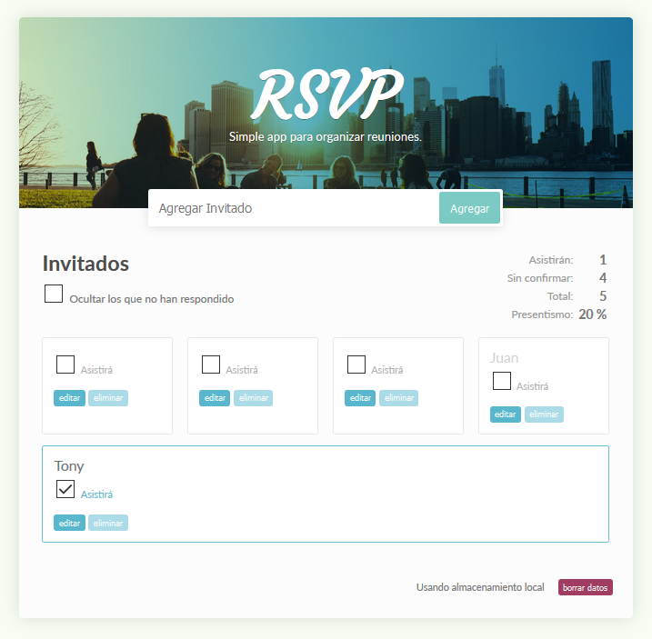

# RSVP - WebApp para organizar reuniones
Una aplicación web de demostración, para llevar la cuenta de invitados a una reunión, ya sea confirmados o no.

[Probala!](https://adperossa.github.io/rsvp-app/)

## Descripción
Originalmente realicé este proyecto sólo con HTML, CSS y Javascript puro, como una forma de practicar la interactividad de JS con el DOM y algunas APIs que el navegador pone a disposición. Era una de las sugerencias de ideas para realizar apps propias dentro del trayecto de Web Developer del sitio TeamTreehouse.

Luego a medida que fui aprendiendo React se me ocurrió refactorearlo con esta librería, para tomar experiencia en tomar una base de código antigua y pasarla a formas de trabajo más modernas. Personalmente creo que usar librerías pesadas para algo tan simple es un desperdicio de recursos si fuera un caso real y no una demo de práctica, ya que React brilla para aplicaciones con muchos datos (especialmente asincrónicos) y muchas actualizaciones de la vista.

En esta segunda etapa al pasarlo a React, le agregué la funcionalidad de guardar un estado local utilizando la API de localStorage provista por los browser. De esta manera es un poco más interactivo y útil.

Se uso **React 16** pero sin Hooks, sino componentes de clase.

## TODO
Agregar validación para no ingresar un usuario sin nombre.